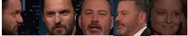

****************************************************************************************************************************
## License and Acknowledgments
ALL RIGHT BELONGS TO PROF. DR. MUHAMMET GÖKHAN CİNSDİKİCİ. Special thanks to Prof. Dr. Muhammet Gökhan Cinsdikici for developing the problem statement and ensuring its relevance.

****************************************************************************************************************************

# Manisa Celal Bayar University -  Computer Engineering Department
# CSE 3228 Artificial Neural Networks - Final Exam  Hackathon

## Schedule

- **Session 1**: January 18, 2024, 15:00 - 17:00 (Additional time possible)
- **Session 2**: January 20, 2024, 12:00 - 13:00

## Rules

- Work individually; no team formation or code exchange.
- No chatting with classmates during Session 1.
- Internet, ChatGPT, and code-generating tools are allowed for Session 1.
- Submit code on Teams after Session 1.
- Submit a detailed report in IEEE format on Teams after Session 2.

## Problem Statement

In this hackathon, you will develop a model to detect and classify faces in a provided talk show video. The model should be capable of identifying the main characters' faces in both large and small sizes, while also recognizing other individuals as a separate category.

### 1. Face Recognition and Classification
- Develop a model to recognize and classify both large and small faces of the main characters in the given video.
- The model should detect these faces in video frames and classify them accordingly.
- Additionally, the model should identify faces not belonging to the main characters and classify them as "others."

### 2. Model Development
- Create a dataset from the video, including images of the main characters' faces in different sizes (large and small).
- Implement the model using techniques learned in Muhammet Erdem's ANN course.
- Provide accuracy plots for training and testing sets at each epoch and include a confusion matrix for the model's performance.

### 3. Dataset Creation and Output
- Detect and locate faces in the video frames using your model.
- Use OpenCV’s face detection tools to identify and register other faces. Store these faces in an "others" dataset.
- Determine the number of unique faces detected in the video.

## Submission
- **Session 1**: Submit your code on the Teams platform.
- **Session 2**: Provide a detailed report explaining your code and methodology in IEEE format.

### Session 1 - Coding

1. **Dataset**: Use a video with at least two celebrities. Construct a dataset with big and small face images.
2. **Model**: Develop a model to classify and detect celebrity faces in the video. Provide accuracy plots and a confusion matrix.
3. **Face Detection**: Detect and locate celebrity faces in the frames.
4. **Registration**: Use OpenCV to find and register other faces. Count unique faces detected.

### Session 2 - Reporting

- Submit a two-column report (IEEE format) covering the problem, methodology, discussion, and conclusions.

## Project Article
[Report](Project-Article.pdf)

****************************************************************************************************************************

# Real-Time Face Detection and Classification System

# Artificial Neural Network Final Hackathon 
Session 2 (January, 2024) 

**Author:** Furkan Bulut  
**Affiliation:** Manisa Celal Bayar University, Faculty of Engineering, Manisa, TURKEY  
**Email:** 210316011@ogr.cbu.edu.tr  

## Abstract

This article introduces a real-time face detection and classification system for videos, emphasizing its dynamic capabilities. Leveraging advanced face detection techniques, the system seamlessly integrates classification by categorizing images of celebrities' faces into different classes, considering variations in facial sizes. This concise guide showcases accurate face detection and its significance in applications like facial recognition and emotion analysis. 

## 1. Introduction
In the realm of computer vision and artificial intelligence, 
the task of facial detection and classification has witnessed 
remarkable advancements, playing a pivotal role in diverse 
applications such as security systems, entertainment, and 
human-computer interaction. This article addresses a 
multifaceted problem—developing a model that not only 
discerns and classifies the faces of celebrities in a given video 
but also extends its capabilities to detect and register other 
faces within the same context. 
## 2. Methodology

### A. Data Preprocessing

A. Data Preprocessing 
Data preprocessing is a crucial step in preparing the input 
data for training a neural network. In this context, we aim to
classify images of celebrities' faces into different categories, 
considering variations in facial sizes. The following 
methodology outlines the steps taken to preprocess the data 
effectively: 
   
1) Data Loading and Initial Inspection: 
Images from different folders, each representing a 
specific class (e.g., 'jake_small_face,' 'jake_big_face,' 
'jimmy_small_face,' 'jimmy_big_face,' 'others'), are loaded 
using the load_images_from_folder function. The function 
reads each image, resizes it to a standardized size (default: 
256x256), and assigns a corresponding label based on the 
folder class. 
2) Data Consolidation: 
The loaded images and labels are consolidated into two 
NumPy arrays: images and labels. The images array 
contains the pixel data of the resized images, while the 
labels array holds the categorical labels in one-hot encoded 
format.
3) Normalization: 
Normalize the pixel values of the images to a standardized 
range (commonly [0, 1]) to enhance model convergence 
during training. This is achieved by dividing the pixel 
values by the maximum pixel value (e.g., 255). 
4) Train-Test Split: 
Split the dataset into training and testing sets using the 
train_test_split function from scikit-learn. This ensures an 
unbiased evaluation of the model's performance. 
5) Model Input Shape Adjustment: 
Adjust the input shape of the images to comply with the 
neural network's requirements. In the provided code, the 
C. Visualizing Training and Validation Accuracy 
2 
images are expected to have a shape of (256, 256, 3) since 
they are resized color images. 
The resulting preprocessed dataset is now ready to be fed 
into the neural network model for training. Effective data 
preprocessing contributes significantly to the model's 
ability to learn and generalize patterns from the input 
images, ultimately enhancing the overall performance of the 
face classification system. 

### B. AlexNet-Based Neural Network Architecture

The architecture of the neural network plays a pivotal role 
in the success of the model for face classification. Here, we 
present the methodology for creating an AlexNet-inspired 
model tailored for our specific task of classifying celebrity 
faces in variable sizes. The following outlines the sequential 
steps involved in constructing the AlexNet-based model: 
1) Convolutional Layers: 
Introduce a Convolutional layer with 96 filters, a kernel size 
of (11, 11), and a stride of (4, 4) to capture complex spatial 
features from the input images. Apply Rectified Linear Unit 
(ReLU) activation to introduce non-linearity. Incorporate 
Batch Normalization for normalizing the activations and 
enhancing convergence. Employ MaxPooling with a pool size 
of (3, 3) and a stride of (2, 2) to down-sample the spatial 
dimensions. 
2) Additional Convolutional Layers: 
Add subsequent Convolutional layers with varying kernel 
sizes (5x5, 3x3) and filter sizes (256, 384) to extract 
hierarchical features at different levels of abstraction. Integrate 
ReLU activation and Batch Normalization in each 
Convolutional layer. Use MaxPooling to down-sample the 
feature maps and maintain spatial hierarchy. 
3) Flattening and Dense Layers: 
Flatten the high-level feature maps into a one-dimensional 
vector to serve as the input for fully connected layers. 
Incorporate Dense (fully connected) layers with 4096 neurons 
to capture complex relationships within the flattened feature 
space. Introduce ReLU activation in the Dense layers to 
enable non-linearity. 
4) Early Stopping Integration: 
A forward-thinking approach to model training is introduced 
through the incorporation of EarlyStopping. This vigilant 
mechanism continually monitors the validation loss during 
each epoch. Should the loss fail to decrease for five 
consecutive epochs (configured patience set to 5), the training 
process is gracefully halted. 
4) Culmination of a Robust Model: 
As the training epochs unfold, the interplay of training, 
validation, and early stopping mechanisms culminates in a 
resilient face classification model. Positioned for real-world 
applications, this model encapsulates adaptability, resilience, 
and a profound understanding of facial features, ready to 
navigate the complexities of diverse datasets. orporate EarlyStopping to monitor validation loss and halt training if the loss fails to decrease for five consecutive epochs.

### C. Visualizing Training and Validation Accuracy

In this segment, we embark on a visual journey through the 
training process of our face classification model, aiming to 
unravel the intricate dynamics of learning. The extraction and 
visualization of training and validation accuracy provide a 
comprehensive narrative, allowing us to glean insights into the 
model's evolution.

   
1) Extracting Crucial Metrics 
The first step involves extracting key metrics from the 
training history, including the accuracy for both the training 
and validation sets. 
2) Crafting the Visual Narrative: 
Armed with our accuracy metrics, we weave a visual 
narrative that encapsulates the essence of the model's learning 
journey. The matplotlib library serves as our artistic tool in 
this endeavor. 

### D. Fine-Tuning and Model Evaluation

Following the training of the AlexNet-based neural network 
for celebrity face classification, the model undergoes fine
tuning and rigorous evaluation. A key evaluation tool is the 
Confusion Matrix, employed to assess the model's ability to 
classify celebrities with varying facial sizes accurately. The 
provided Python code snippet demonstrates the transformation 
of test labels and model predictions, leading to the creation and 
visualization of the confusion matrix. This heatmap 
visualization aids in pinpointing areas where the model may 
face challenges. This succinct process is integral to refining the 
model for optimal performance, ensuring its adaptability to 
diverse facial features in real-world scenarios. 
   

### E. Inference on New Images and Result Visualization

Once the AlexNet-based model has been fine-tuned and 
evaluated, it becomes valuable to apply the model to new 
images for real-time classification. The provided Python code 
illustrates an inference function that utilizes the trained model 
to detect faces in a new image and predict their categories. 
The MTCNN (Multi-task Cascaded Convolutional Networks) 
is employed for face detection, and the model then classifies 
each detected face. The resulting image is annotated with 
bounding boxes around the detected faces and labeled with 
their respective categories. This process facilitates the model's 
adaptability to diverse facial sizes and further enhances its 
utility in practical scenarios. 
   

detect_faces_and_predict_video that utilizes a pre-trained 
face detection model (detector) and an AlexNet-based face 
classification model (alexnet_model) to process frames from a 
given video file. The function reads each frame, detects faces 
using the MTCNN face detector, and classifies each detected 
face using the AlexNet model. The resulting video is displayed 
in real-time with bounding boxes around detected faces, 
corresponding labels, and coordinates. 
### F. Face Detection and Unique Face Extraction from Video

A  robust face detection and extraction system is 
implemented to process a video file and save unique faces in a 
specified output folder. The methodology involves utilizing 
the OpenCV library to load a pre-trained face detection model 
and extracting faces from consecutive frames.  The face 
detection process occurs at a defined time interval, enhancing 
efficiency. Detected faces are cropped from the frames, and a 
unique identifier based on pixel values ensures only distinct 
faces are saved. The extracted faces are then stored in the 
'others' dataset folder. 
## 3. Discussion
In this article, a real-time face detection and classification 
system is introduced, emphasizing significant advancements in 
computer vision and artificial intelligence. The system 
seamlessly integrates advanced face detection techniques and 
classification using an AlexNet-like model, showcasing its 
dynamic capabilities in analyzing celebrity faces within 
videos. Demonstrations highlight the importance of accurate 
face detection in applications such as facial recognition and 
emotion analysis. The article serves as a concise guide for 
developers and researchers interested in a dynamic approach 
to real-time facial analysis. 
The methodology section outlines crucial steps in data 
preprocessing and the design of an AlexNet-inspired neural 
network architecture. Data preprocessing involves loading 
images, consolidating them into NumPy arrays, normalization, 
and train-test splitting. The AlexNet-based architecture, 
tailored for classifying variable-sized celebrity faces, includes 
convolutional layers, dense layers, and early stopping 
integration. 
The discussion delves into the implications and strengths of 
the proposed system. Effective data preprocessing is identified 
as a cornerstone, ensuring well-structured input data for the 
neural network. The AlexNet-inspired architecture is 
commended for its thoughtful design in capturing hierarchical 
features and complex relationships within facial images. 
Training visualization, fine-tuning, and model evaluation 
contribute to refining the system, while challenges and 
potential future directions, such as handling variations in 
lighting and exploring advanced face detection models, are 
discussed. 
## 4. Conclusion
Consequently, the real-time face detection and classification 
system presented in this article offers a robust solution for 
dynamic facial analysis in videos. The integration of advanced 
techniques and an AlexNet-inspired model demonstrates 
adaptability in recognizing celebrity faces of varying sizes. 
The systematic methodology, emphasizing effective data 
preprocessing and neural network architecture, serves as a 
practical guide. While acknowledging its strengths, challenges 
such as lighting variations are recognized, urging future 
enhancements. The system's real-time inference and face 
extraction capabilities hold promise for diverse applications. 
This work lays a foundation for ongoing advancements in 
facial analysis, encouraging further exploration and refinement 
in computer vision and AI.
****************************************************************************************************************************
## License and Acknowledgments
ALL RIGHT BELONGS TO PROF. DR. MUHAMMET GÖKHAN CİNSDİKİCİ. Special thanks to Prof. Dr. Muhammet Gökhan Cinsdikici for developing the problem statement and ensuring its relevance.

****************************************************************************************************************************
